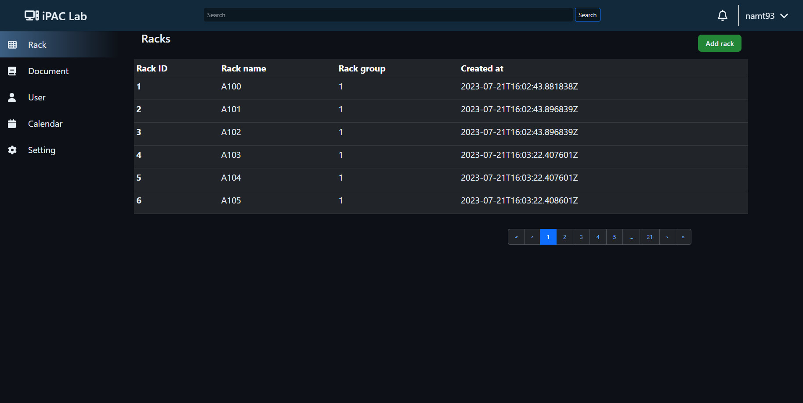
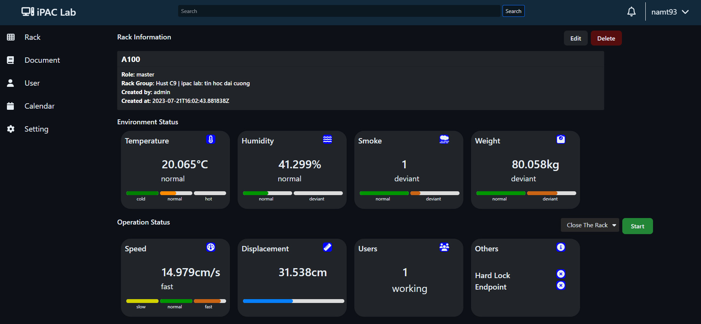
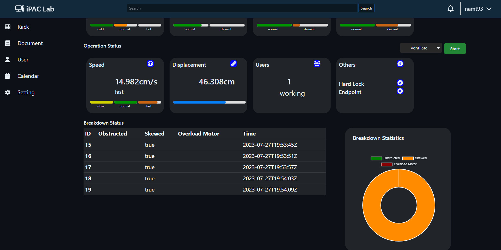

# inventory-management-system-project
## The Rack page


## The Rack status page



## Requirement

- Django==4.1.7
- djangorestframework==3.14.0
- mysql-connector==2.2.9
- mysql-connector-python==8.0.33

## Usage

Clone it!

```
$ git clone git@github.com:namt93/inventory-management-system-project.git
```

Go into the project InventoryWeb/ and run the command:
## Backend

- Start server - `$ python mangage.py runserver`

## Frontend
- Go to /front-end/inventory-ui
- Start server - `$ npm start`

Open `http://localhost:3002` and enjoy!